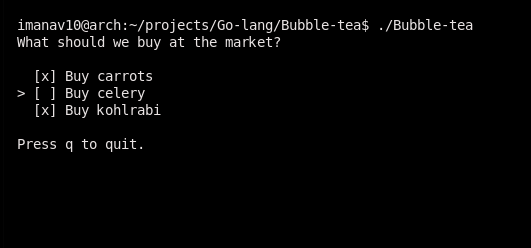

## Bubble-tea 
demo program
  

;;;;;;;;;;;;;;;;;;;;;;;;;;;;;;;;;;;;;;;;;;;;;;;;;;;;;;;;;;;;;

<h1>Notes</h1>

- 
The make keyword in Go is a built-in function that's primarily used to create slices, maps, and channels

- 
lmao bbgs

